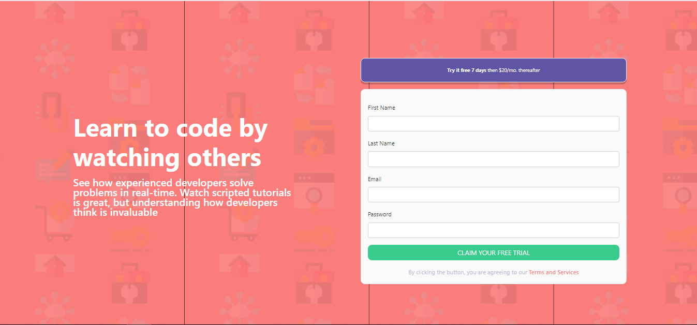
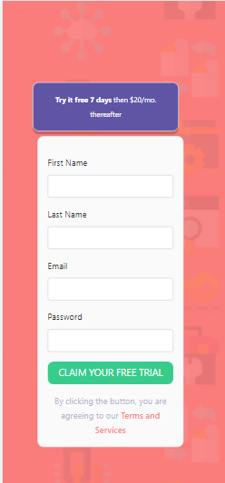
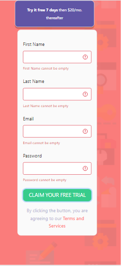

# Test 1

This project was generated with [Angular CLI](https://github.com/angular/angular-cli) version 9.1.15.

## Development server

Run `ng serve` for a dev server. Navigate to `http://localhost:4200/`. The app will automatically reload if you change any of the source files.

##  The Desktop View

##  The Desktop View with Error

##  Mobile View

##  Mobile View

##  Mobile View

